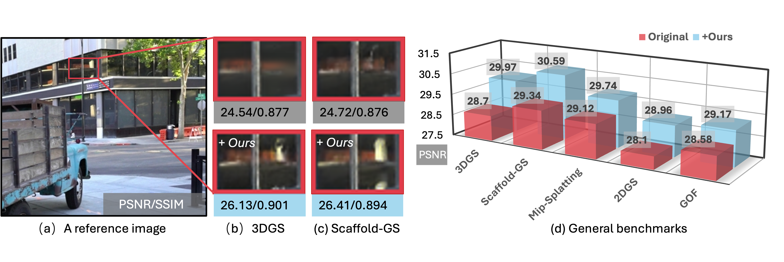

<h2 align="center"> <a href="https://xiaobiaodu.github.io/mvgs-project/">MVGS: Multi-View Regulated Gaussian Splatting for Novel View Synthesis</a></h2>
<h5 align="center"> If you like our project, please give us a star ⭐ on GitHub for latest update.  </h2>

<h5 align="center">

<h5 align="center">
<p align="center">
  <a href="https://xiaobiaodu.github.io/">Xiaobiao Du</a><sup>123</sup> ·
  <a href="https://wangyida.github.io/">Yida Wang</a><sup>3</sup> ·
  <a href="https://sites.google.com/view/xinyus-homepage/Home">Xin Yu</a><sup>2</sup>
</p>

<p align="center"><sup>1</sup>The University of Technology Sydney · <sup>2</sup>The University of Queensland · <sup>3</sup>Li Auto Inc.</p>
<h5 align="center">

### <p align="center">[🌐Project Page](https://xiaobiaodu.github.io/mvgs-project/) | [🖨️ArXiv](https://arxiv.org/pdf/2410.02103) | [📰Paper](https://arxiv.org/pdf/2410.02103)</p>





## 😮 Highlights
MVGS can be easily embeded into existing Gaussian-based explict representation methods for better novel view synthesis results.
 We transform a traditional training paradigm only constrained by a single-view supervision per training iteration with our proposed multi-view training.
### 🔥 Four key Contributions 
- Multi-view constraint loss:
We first propose to supplement multi-view constraints during optimization towards the 3D Gaussian attributes. As a general solution, we improve the overall accuracy in a variety of scenarios and different Gaussian-based methods.
- Cross-intrinsic Guidance method: training in a coarse-to-fine manner with regard to different resolutions.
- Cross-ray Densification: densifying more 3D Gaussians in ray-intersect regions. 
- Multi-view Augmented Densification Strategy:  to enhance the effect of densification while each view is distinct dramatically. 

## 🚩 **Updates**

Welcome to **watch** 👀 this repository for the latest updates.

✅ **[2024.10.4]** : Release [project page](https://xiaobiaodu.github.io/mvgs-project/).

✅ **[2024.10.4]** : Code Release. 


## Installation

1. Clone this repo:

```
git clone https://github.com/xiaobiaodu/MVGS.git --recursive
cd MVGS
```

2. Install dependencies (Skip, if you've installed environment for 3DGS.)
```
conda env create --file environment.yml
conda activate mvgs
```

## Quickstart

#### Public Data
The MipNeRF360 scenes are provided by the paper's author and can be accessed [here](https://jonbarron.info/mipnerf360/). 

#### Custom Data
For custom data, process the image sequences using [Colmap](https://colmap.github.io/) to obtain SfM points and camera poses. 

#### Run

Below code requires at least 40G GPU memory.
```
python run_360.py
```
If your GPU memory is limited, try decrease mv value like below code:
```
python train.py -s  {data_path}   --eval --white_background  -m {save_path}  --mv  6  
```

## Interactive Viewer
Please see the [original 3DGS repository](https://github.com/graphdeco-inria/gaussian-splatting). Our method can be seemlessly integrated in the original 3DGS


## ✏️ Citation

If you find our paper and code useful in your research, please consider giving a star :star: and citation :pencil:.


```BibTeX
@misc{du2024mvgsmultiviewregulatedgaussiansplatting,
      title={MVGS: Multi-view-regulated Gaussian Splatting for Novel View Synthesis}, 
      author={Xiaobiao Du and Yida Wang and Xin Yu},
      year={2024},
      eprint={2410.02103},
      archivePrefix={arXiv},
      primaryClass={cs.CV},
      url={https://arxiv.org/abs/2410.02103}, 
}
```
